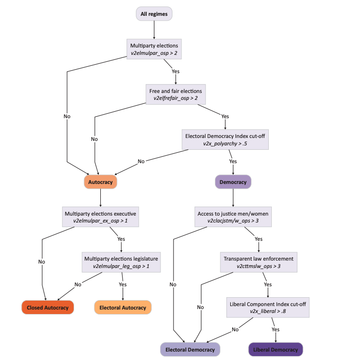

# Forecasting Political Instability

We aim to develop an ensemble model consisting of constituent models that each perform prediction using a subset of the variables. Essentially, we will be considering different factors to inform multiple predictions of national violence and instability, then combine these predictions into a resultant probability of conflict. Examples of constituent models that we may explore include regression on conflict history, modeling of natural resources or disease, or trends of civil unrest. Particularly, we will be building out machine learning models in Python to generate predictions from the input data.

After attaining constituent model results, we aim to use some form of Bayesian Model Averaging to aggregate them. In addition, we plan to visualize our results by generating graphs that help to understand the interplay of important indicator variables and violence. For example, we could create heat maps comparing the densities of the most relevant predictor variables from our models to the density of historical violence within each country. Ultimately, the result of this project will be a series of models which, when combined, output a singular likelihood of national violence/instability for each nation considered.

## Variables in Use

### World Bank Indicators

The following variables are from the World Bank and recommended by the Uppsala Data Program as indicators of conflict:

a. GDP per Capita in 2017 PPP
b. Population
c. Oil Rent as % of GDP
d. Oil Rent per GDP Capita
e. GDP per Capita without Oil Rent

### V-Dem: Varieties of Democracy

Using the V-Dem project, we select several variables identified as being relevant to classifying national regime types, ultimately categorizing as either democratic or authoritarian:

### ACLED (Armed Conflict Location and Event Data)

From ACLED, we download all data available in every year and every country of every event type.

### Uppsala Conflict Data Program

Using the Uppsala Conflict Data Program repository, we download all individual events of organized events, operationalized as phenomena of lethal violence occurring at a given time and place. 

### Correlates of War

The Correlates of War Project maintains data across several categories, though the time series are somewhat limited; the most relevant are:

a. War Data, 1816 - 2007
b. National Material Capabilities, 1816-2012

with the latter being relevant due to power as a central concept in explaining conflict, and containing the following variables:

a. Military Expenditure
b. Military Personnel
c. Energy Consumption
d. Iron and Steel Production
e. Urban Population
f. Total Population
